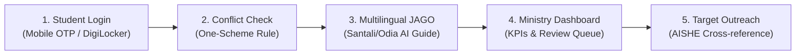

# TribalSetu — Demonstration & Golden Path Guide
**Smart India Hackathon (SIH 2026) | Problem Statement: SIH26238**  
**Unified Scholarship Mobile Application for Tribal Students — Ministry of Tribal Affairs (MoTA)**

---

## 1. Quick Startup Instructions

TribalSetu is architected as a high-performance monorepo:
- **Backend:** FastAPI, SQLAlchemy, Alembic, Pytest (140+ automated tests).
- **Frontend:** Flutter (Android, Web, Windows Desktop, iOS) with dynamic Mock vs API switching.

### 1.1 Start Backend (FastAPI)
```bash
# Navigate to backend
cd backend

# Activate virtual environment
# Windows:
.venv\Scripts\activate
# macOS/Linux:
source .venv/bin/activate

# Seed demo database (creates 5 seeded users, 5 MoTA schemes, 3 applications, 9 mock verification adapters)
python -m app.seed --reset

# Start the API server on http://localhost:8000
uvicorn app.main:app --reload --host 0.0.0.0 --port 8000
```
- Interactive Swagger API Documentation: [http://localhost:8000/docs](http://localhost:8000/docs)
- ReDoc API Documentation: [http://localhost:8000/redoc](http://localhost:8000/redoc)
- Health Check: [http://localhost:8000/health](http://localhost:8000/health)

### 1.2 Start Frontend (Flutter)
```bash
# Navigate to frontend
cd frontend

# Mode A: Mock Mode (Self-contained, offline-ready, ideal for fast visual UI demos)
flutter run -d chrome
# or on Windows desktop:
flutter run -d windows

# Mode B: Live API Mode (Connected to real FastAPI backend)
# For Web (Chrome on fixed port 5000):
flutter run -d chrome --web-port 5000 --dart-define=API_BASE_URL=http://localhost:8000

# For Android Emulator (10.0.2.2 maps to host machine localhost):
flutter run -d emulator-5554 --dart-define=USE_MOCK=false --dart-define=API_BASE_URL=http://10.0.2.2:8000
```

---

## 2. Seed Credentials & Test Accounts

| Role | Email / Username | Mobile Number | Password / OTP | Purpose in Demo |
| :--- | :--- | :--- | :--- | :--- |
| **Admin / Ministry** | `admin.mota@tribalsetu.gov.in` | `9876543299` | `AdminSecret123!` / `123456` | Access Ministry KPI Dashboard, Review Queue & Outreach Engine |
| **Student 1 (Active)** | `student.st@tribalsetu.gov.in` | `9876543210` | `StudentSecret123!` / `123456` | Birsa Soren: Has active Post-Matric application (Under Review), NFST (Deficiency), Pre-Matric (Sanctioned) |
| **Student 2 (Unreached)** | `student2.st@tribalsetu.gov.in` | `9876543211` | `StudentSecret123!` / `123456` | Rani Marandi: Enrolled in AISHE college, 0 applications. Demonstrates Unreached Beneficiary Outreach |
| **Institute Nodal Officer**| `institute.nodal@tribalsetu.gov.in`| `9876543220` | `InstituteSecret123!` / `123456` | Institutional verification nodal officer |

---

## 3. 3-Minute "Golden Path" Demo Script

Follow this precise walkthrough for jury evaluations and prototype presentations.



### Minute 0:00 – 0:45: Student Authentication & Central Profile
1. **Launch App:** Open TribalSetu on Flutter Web, Windows, or Android.
2. **Login Screen:** Select **Mobile Number** login. Enter `9876543210` and click **Continue**.
3. **OTP Screen:** Enter default demo OTP `123456`.
4. **Student Dashboard:**
   - Observe the authentic Indian tribal pattern header and Government of India seal.
   - Highlights student greeting: *"Namaste, Birsa Soren"*.
   - View quick status cards showing application progress, DBT payment tracker, and DigiLocker wallet.

---

### Minute 0:45 – 1:30: Scheme Discovery & "One Scheme at a Time" Conflict Check
1. **Explore Schemes:** Tap the **Scholarships** tab on the bottom navigation bar.
2. **Unified Scheme Catalogue:** Browse the 5 official MoTA scholarship schemes:
   - *Post Matric Scholarship for ST Students*
   - *Top Class Education Scheme for ST Students*
   - *National Fellowship for ST Students (NFST)*
   - *Pre Matric Scholarship for ST Students*
   - *National Overseas Scholarship (NOS)*
3. **Trigger Conflict Check:**
   - Tap on **Top Class Education Scheme** -> tap **Check Eligibility**.
   - Tap **Proceed to Apply**.
4. **Verify Blocking Conflict Dialog:**
   - A blocking modal appears titled **"Scheme Conflict Detected — One Scheme at a Time Rule"**.
   - Explains MoTA policy preventing duplicate benefit disbursal.
   - Accurately identifies the conflicting application: `app-2024-st-01` (`POST_MATRIC`).
   - Tap **"View Conflicting Application"** to navigate directly to the application tracker timeline.

---

### Minute 1:30 – 2:15: Multilingual JAGO AI Guide (Santali, Odia, Hindi)
1. **Open JAGO Assistant:** Tap the center **JAGO** bot icon in the bottom navigation.
2. **Synchronized Multilingual Pill:**
   - Observe the language selector pills: `English`, `हिन्दी`, `ᱥᱟᱱᱛᱟᱲᱤ` (Santali), `ଓଡ଼ିଆ` (Odia), `गोण्डी` (Gondi).
   - Switch language to **ᱥᱟᱱᱛᱟᱲᱤ (Santali)**.
3. **Localized Prompting:**
   - Observe the suggestion chips switch immediately to Ol Chiki script:
     - `ᱤᱧᱟᱜ ᱟᱵᱮᱫᱚᱱ ᱚᱵᱚᱥᱛᱟ ᱵᱤᱰᱟᱹᱣ ᱢᱮ` (Check my application status)
     - `ᱪᱮᱫ ᱠᱟᱜᱚᱡᱽ ᱠᱚᱢ ᱢᱮᱱᱟᱜ-ᱟ?` (What documents are missing?)
     - `DBT ᱴᱟᱠᱟ ᱚᱵᱚᱥᱛᱟ` (Check DBT payment status)
4. **Instant Accurate Reply:**
   - Tap `DBT ᱴᱟᱠᱟ ᱚᱵᱚᱥᱛᱟ`. JAGO responds with localized DBT status in Ol Chiki!
   - Switch language to **ଓଡ଼ିଆ (Odia)** and ask about eligibility. JAGO responds in fluent Odia script.

---

### Minute 2:15 – 3:00: Ministry Portal, Manual Review & Unreached Outreach Engine
1. **Switch to Ministry Admin:**
   - Log out from student profile.
   - Log in using Admin credentials:
     - Email: `admin.mota@tribalsetu.gov.in`
     - Password: `AdminSecret123!`
   - Role-based routing automatically detects `UserRole.admin` and routes to `/admin` dashboard.
2. **Ministry Overview Tab:**
   - View live KPI cards calculated from `/api/v1/analytics/dashboard`:
     - *Total Applications, Under Review, Disbursed, Unreached Beneficiaries (60%)*.
3. **Manual Review Queue Tab:**
   - Review pending discrepancy: *Sunita Soren — Income Certificate mismatch*.
   - Click **Approve** or **Reject** with nodal remarks. Status synchronizes atomically across records.
4. **Unreached Beneficiaries Outreach Tab:**
   - View students identified by cross-referencing AISHE higher education enrollments against scholarship databases.
   - Spot **Rani Marandi** (`ENROL-ST-002` at Tribal Welfare College, Bhubaneswar — Status: `UNREACHED`).
   - Click **"Send Outreach"**.
   - Confirmation badge indicates awareness notification dispatched.
   - *Result:* Rani Marandi receives a notification in her feed urging her to claim her scholarship through JAGO assistance!

---

## 4. Simulated & Sandbox Integrations Disclosure

Per SIH guidelines and realistic enterprise architecture, all external departmental workflows are implemented using modular sandbox adapters:

1. **UIDAI Aadhaar e-KYC Sandbox:** Real-time demographic name, gender, and Aadhaar-linked status verification.
2. **DigiLocker Integration Simulator:** Pulls authenticated digital certificates (Caste, Income, Class 10/12 Marksheets) with cryptographic hash tracking.
3. **AISHE (Higher Education Enrollment):** Verifies student college enrollment status and course eligibility.
4. **UDISE+ (School Education):** Pre-matric student verification.
5. **APAAR / ABC ID:** Unified student identity registry verification.
6. **UGC-NTA Adapter:** Fellowship eligibility verification for National Fellowship (NFST).
7. **State e-District Portals:** Cross-verifies income and domicile certificates with state databases.
8. **National Scholarship Portal (NSP) Bridge:** Legacy scholarship reconciliation.
9. **PFMS & NOS DBT Gateway:** Direct Benefit Transfer disbursement simulation with bank account seeding checks.
